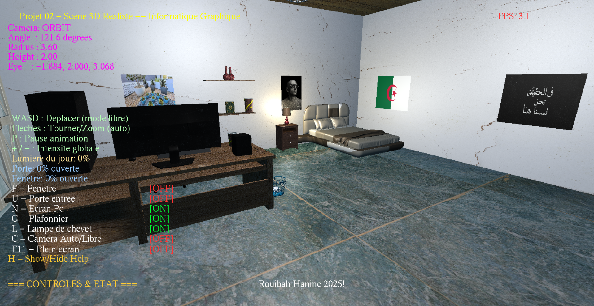
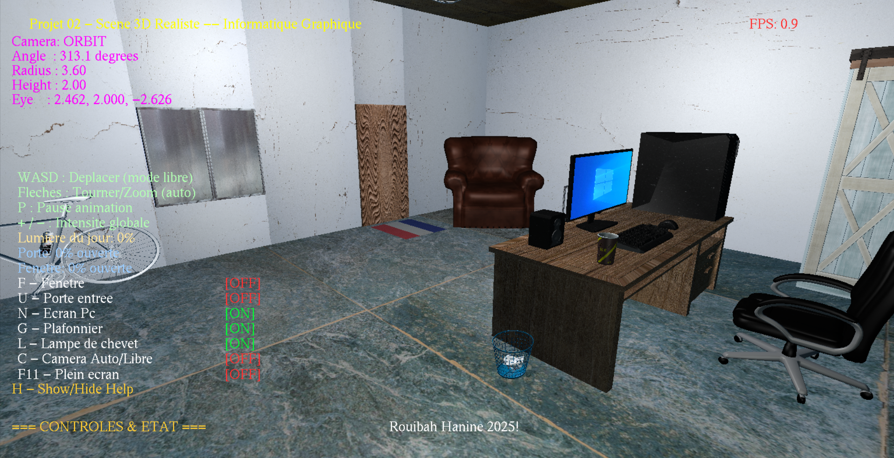

# 3D Realistic Scene Project

## Overview
This project is a realistic 3D scene renderer built using OpenGL in C++. It simulates a detailed bedroom environment with interactive elements such as furniture, lighting, doors, windows, and camera controls. The scene includes dynamic lighting (point lights, directional sunlight), texture mapping, and basic animations for doors and windows. Models are loaded from OBJ files, and textures enhance realism.
The project demonstrates concepts in computer graphics, including shader-based rendering, matrix transformations, lighting models (ambient, diffuse, specular), and user interaction via keyboard and mouse.

## Features

•Interactive Camera Modes: 
Auto-orbit mode for smooth circling around the scene. 
Free-FPS mode with mouse-look and WASD movement (clamped within room bounds). 

•Dynamic Lighting: 
Sunlight (directional) influenced by window/door openness. 
Point lights: Desk lamp, ceiling light, and door light. 
Toggle lights and adjust intensity. 

•Animations and Interactions: 
Open/close doors and windows with sound effects (Windows-only). 
Toggle PC screen, lamps, and other elements. 
Smooth animations for door/window movements. 

•3D Models and Textures:
Loaded OBJ models: Bed, desk, chair, lamp, PC, wardrobe, bike, etc. 
Textures for walls, floor, ceiling, and objects (e.g., wood, metal, posters). 

•HUD and UI:
On-screen FPS display (smoothed and calibrated). 
Help menu with controls and status (toggle with 'H'). 
Fullscreen support (F11). 

•Performance:
FPS calculation with smoothing for stable display. 
Clamped camera to prevent clipping through walls. 

## Requirements

•Operating System: Windows (due to sound playback via PlaySound). Can be adapted for other OS.
•Libraries: 
OpenGL (core profile via GLEW). 
GLUT/FreeGLUT for windowing and input. 
GLM for matrix math. 
STB_IMAGE for texture loading. 
TinyOBJLoader for OBJ model loading. 

•Compiler: Visual Studio or any C++ compiler supporting C++11 (e.g., g++). 
•Hardware: GPU supporting OpenGL 3.3+ for shaders. 

## Controls

•Camera: 
'C': Toggle between Auto-Orbit and Free-FPS modes. 
Arrow Keys (Auto): Rotate/zoom orbit. 
WASD (Free): Move forward/back/left/right. 
Mouse (Free): Look around (capture with 'B'). 

•Lights: 
'L': Toggle desk lamp. 
'G': Toggle ceiling light. 
'+/-': Adjust global light intensity. 

•Interactions: 
'U': Open/close door (with sound). 
'F': Open/close window. 
'N': Toggle PC screen. 
'P': Pause animations. 

•Other: 
'H': Show/hide help menu. 
F11: Toggle fullscreen. 
'B': Toggle mouse capture in Free mode. 

## Project Structure

Source: Single main.cpp file (modularized with functions for drawing, input, etc.). 
Resources: 
Ressources/textures/: JPG/PNG textures (floor, walls, objects). 
Ressources/objects/: OBJ models (bed.obj, lamp.obj, etc.). 
Ressources/shaders/: Vertex (shader.vert) and fragment (shader.frag) shaders. 
Ressources/sounds/: WAV files for door open/close. 
Ressources/images/: Posters and additional images. 

## Known Issues

Sound playback is Windows-specific; adapt for cross-platform. 
Some models/textures may fail to load if paths are incorrect—check console errors. 
FPS display is calibrated over time; initial values may fluctuate. 
No collision detection beyond basic clamping. 

## Credits

Author: Rouibah Hanine (2025). 
Libraries: STB_Image (Sean Barrett), TinyOBJLoader, GLM, GLEW, FreeGLUT. 
Inspired by computer graphics tutorials on lighting and scene rendering. 

## License
This project is licensed under the MIT License - see the LICENSE file for details.
